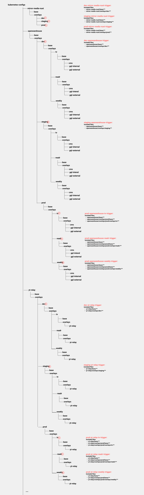

# major-tom-go v2

`major-tom-go` is a bot written in golang to help change the configurations on kubernetes easily via GitOps and will play a role in the CI pipeline.

The `kubernetes-configs` repository will be the sole resource of GitOps.

## Proposal

The following is the proposal of API design for `major-tom-go` `v2`, and `v2` will be a breaking change.

`major-tom-go v2` will be referred as `major tom` below.
## Operations

`major tom` should support the following operations:

1. Change the image tag to be deployed
2. Change the autoscaling configurations for deployments
3. Change the current pod numbers
4. List the changes in history
5. List the supported resource
6. Show the current deployment info

These operation should be supported services in all stages of all projects in the end, but the **initial implementation** will only support the `mittor-tv` project and change of image tag.

## API Design Proposal

I would separate the operation to four categories:

1. Image change
2. Scaling
3. List
4. Info

According to the design of `kubernetes-configs`, the image tag will be defined in different level of folders from `prod` to `staging` and `dev`.

### Image change

Thus two different api are designed for them. Reasons will be given after the following section.

1. `release`: means release a image tag
   1. `release {repo} {project} {image tag}` for the likes of `openwarehouse`
   2.  `release {repo} {image tag}` for the likes of `mirror-tv-nuxt`

It will look for the `kustomize.yaml` in the project folder, if specified, of `prod` by default.

1. `deploy`: can deploy a image to staing or dev environments for all projects
   1. `deploy {repo} {stage} {image tag}`

I choose two separate commands to change image tag in different environments because

- Their structure in `kubernetes-configs` are different.
- `deploy` will deploy image to all projects but `release` will only deploy the image to the specific project. They are essential two different operations.
- `release` emphasize the importance of the command and help communication.
- Combining them would make the command implementation cumbersome.

### Scaling

`scale`: 

`scale {service} {stage} {project} conf1:value1 conf2:value2 ...` for the likes of `openwarehouse`

Because we established a [naming and folder structure convention](https://github.com/mirror-media/kubernetes-configs/commit/f0fc6c2ca18e1c3a8fb6df50a4882121d5b67548) for `kubernetes-configs`, `major tom` doesn't need the repo name to find the desired `kustomize.yaml`. With a service name merely, `major tom` can identify the repo with confidence.

#### The supported conf are

- maxReplicas
- minReplicas

and they are not required to be both supplied in the same command.

Their values should be a positive number and `major tom` will validate them.

`major tom` will look for `hpa.yaml` in the service folder or stage folder depending on the structure of the repo.

If `major tom` doesn't find a `hpa.yaml` at the desired location, it will respond with `auto scaling is not support for the service`.

If we specify a replica number in the `Deployment` resource, then it will always try deploy the number each time. It may have unwanted side-effect, so leaving it to autoscaling would be a better idea.

To change the current replica, one could use `scale` to change the scale in or scale out immediately.
